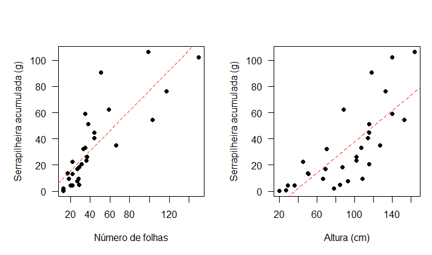
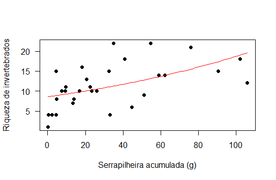

```{r setup, include=FALSE}
knitr::opts_chunk$set(echo = TRUE)
```
### Importância ecológica da serrapilheira

A serrapilheira é composta por detritos de várias origens, sendo nos trópicos principalmente formada por folhas em diferentes estágios de decomposição (Morellato, 1992). Apesar de ser mais abundante no solo, a serrapilheira pode ser acumulada também sobre emaranhados de trepadeiras, epífitas, folhas e ramos de árvores dando uma estrutura tridimensional à matéria orgânica morta (Longino & Nadkarni, 1990). Por ocorrer em diferentes microambientes, a serrapilheira difere em vários aspectos tais como umidade, temperatura, área e volume, o que determinam a presença invertebrados associados ao acúmulo de serrapilheira (Longino & Nadkarni, 1990; Correia & Oliveira, 2000). A produção de serrapilheira, juntamente com a heterogeneidade da vegetação resultam em alta complexidade estrutural, permitindo que essa diversidade de condições abrigue uma comunidade também muito diversa, composta por diferentes grupos de invertebrados tais como: formigas, opiliones, aranhas, coleópteros, ácaros etc (Siqueira et al, 2012). 

### E no meio do caminho, um  reservatório suspenso de serrapilheira!

Quando estava no mestrado (lá em 2012), participei do (divertido, sofrido, cansativo, produtivo etc) curso de campo. Juntamente com mais duas amigas (J.C. Braidotti e H.H.S. Vitor) desenvolvi um pequeno projeto de pesquisa com comunidades de invertebrados em serrapilheira acumulada em copas de *Erythrochiton brasiliensis*.

*Erythrochiton brasiliensis* (Nees & Mart)  é uma espécie de porte arbustivo e hábito terrícola pertencente à família Rutaceae. Suas flores são brancas com corola ampla, alva e longo cálice variando de coloração rosada a avermelhada, dispostas no ápice de inflorescências longo-pedunculadas. *E. brasiliensis* apresenta distribuição neotropical, com ocorrência na Venezuela, Guianas e Brasil. É uma espécie nativa não endêmica do Brasil.  No território brasileiro há ocorrências confirmadas nos domínios fitogeográficos da Amazônia e da Mata Atlântica. Na Mata Atlântica *E. brasiliensis* ocorre na região Sudeste nos estados de Espírito Santo, Minas Gerais, e Rio de Janeiro. Estas informações foram extraídas do *site* Programa REFLORA (<http://reflora.jbrj.gov.br>).  

O sistema estudado localiza-se na "Trilha do vinhático" no Parque Estadual do Rio Doce (PERD) no estado de Minas Gerais (<http://www.ief.mg.gov.br/>). Ao longo da trilha haviam (espero que ainda existam) várias manchas de *E. brasiliensis*. Observamos em campo que a arquitetura desta planta parece favorecer o acúmulo da serrapilheira, provalmente composta por folhas, galhos, flores e frutos das espécies arbóreas acima das manchas (Figura 1).  


O  objetivo do estudo foi inventariar a fauna associada à serrapilheira acumulada na copa de *E. brasiliensis*, e adicionalmente elaboramos duas hipóteses muito simples (e talvez, óbvias): 

H1: o acúmulo de serrapilheira aumenta com complexidade estrutural de *E. brasiliensis*;

H2: a riqueza de invertebrados aumenta com o acúmulo de serrapilheira.


### Mão na massa! (ou melhor, na serrapilheira!)

Amostramos 30 espécimes de *E. brasiliensis* em julho de 2012. Coletamos a serrapilheira acumulada pela técnica de batimento. Durante o batimento, toda a copa da planta foi acondicionada dentro de um saco plástico para evitar perda de serrapilheira e fuga dos invertebrados. O material ainda remanescente foi removido da planta com um pincel. 

Em laboratório peneiramos a serrapilheira em peneira de 500 μm e triamos somente a porção retida nesta granulometria. Triamos os organismos manualmente sob lupa (32x) e posteriormente os fixamos em álcool a 70% e os
identificamos em nível de morfoespécie. 

Para determinar a biomassa da serrapilheira, nós secamos o material coletado em estufa por 72hs a 60°C. Após esse período, nós pesamos o material em balança de precisão.

Nós construímos modelos lineares generalizados (Crawley, 2007) para testar nossas duas hipóteses. A biomassa de serrapilheira foi inserida no modelo como variável resposta e a altura e número de folhas como variáveis explicativas (H1). A riqueza de invertebrados foi inserida como variável resposta e a biomassa de serrapilheira como variável explicativa (H2). Para os modelos relacionados à H1, nós utilizamos a distribuição de erro Gaussiana, e para aquele relacionado à H2, a quasipoisson.  


### *Indivíduos mais altos, possuem mais folhas, logo acumulam maior biomassa de serrapilheira (H1)*

O acúmulo de serrapilheira (gramas) foi positivamente influenciado pela altura (Deviance = 15452, Df = 28, p < 0.001), e pelo número de folhas dos indivíduos (Deviance = 18657, Df = 28, p < 0.001) (Figura 2). Ou seja, a complexidade estrutural da planta funciona como um eficiente depósito de serrapilheira. Neste trabalho nós não mensuramos a taxa de acúmulo ou mesmo a de decomposição da serrapilheira ao longo do tempo. Fica a dica caso alguém, algum dia, queira reproduzir este estudo em um ecossistema semelhante. ;-) 

```{r include=FALSE}
serrap <- read.csv("./data/serrapilheira.csv")

biomassa <- serrap$biomassa_serrapilheira_g
folhas <- serrap$num_folhas
altura <- serrap$altura_total_cm
riqueza <- serrap$riqueza

mod_h1 <- glm(biomassa ~ folhas * altura)

anova(mod_h1,test = "Chisq")

# plots
par(mfrow = c(1, 2), mar = c(5, 5, 4, 1))
plot(
  biomassa ~ folhas,
  pch = 16,
  las = 1,
  xlab = "Número de folhas",
  ylab = "Serrapilheira acumulada (g)"
)
abline(mod_h1, lty = 2, col = "red")

plot(
  biomassa ~ altura,
  pch = 16,
  las = 1,
  xlab = "Altura (cm)",
  ylab = "Serrapilheira acumulada (g)"
)
abline(mod_h1, lty = 2, col = "red")
dev.off()
```


### *E quanto maior o acúmulo de serrapilheira, maior a riqueza de invertebrados (H2)*

Nós identificamos 72 morfoespécies de invertebrados (média: 11,4; desvio padrão: 5,56). A planta com maior riqueza de invertebrados continha 22 morfoespécies, e na de menor riqueza identificamos apenas uma morfoespécie. 

A riqueza de invertebrados aumentou com o acúmulo de serrapilheira depositada entre as folhas de *E. brasiliensis* (Deviance = 21.509, Df = 28, p < 0.01) (Figura 3). Este resultado corrobora a importância da serrapilheira como um recurso para os invertebrados que ali vivem. Ali, muitos detrítivoros, como os colêmbolos encontram alimento. Outros táxons podem utilizar a serrapilheira como abrigo, seja da luz (fotofobia) ou mesmo de outro predadores, como as aranhas (Longino & Nadkarni, 1990). 


```{r include=FALSE}
mod_3 = glm(riqueza ~ biomassa, family = quasipoisson)
anova(mod_3,test = "Chisq")

# plot 3
plot(
  riqueza ~ biomassa,
  pch = 16,
  las = 1,
  xlab = "Serrapilheira acumulada (g)",
  ylab = "Riqueza de invertebrados"
)
curve(exp(2.147680 + 0.007803 * x), add = T, col = "red")
```

Bem, nosso trabalho na época terminou por aqui. Vimos com este estudo que o material que cai imediatmente das árvores acima das manchas de *E. brasiliensis* são retidos entre suas folhas devido à sua arquitetura vegetal. Plantas mais altas e com maior número de folhas são capazes de acumular maior quantidade de serrapilheira. E quanto maior a quantidade de serrapilheira acumulada, maior é a riqueza de invertebrados associados. 

Note entretanto, que há uma série de outras questões que podem ser exploradas daqui em diante neste mesmo super top sistema ecológico. Assim, próximos estudos podem: i) compararar a fauna associada à serripilheira de *E. brasiliensis*, com aquela presente no solo adjacente (spoiler!); ii) avaliar as guiltas tróficas; iii) a composição e qualidade nutricional da serrapilheira; iv) avaliar a partição de diversidade; e por aí vai. Ou seja, o céu é o limite! 

### Bibliografia

Correia, M. E. F., L. C. M. de Oliveira. 2000. Fauna de Solo: Aspectos Gerais e Metodologicos. Seropedica: Embrapa Agrobiologia. p. 46

Crawley M.J. 2007. The R book. Wiley, Chichester.

Longino, J.T. & N.M. Nadkarni. 1990. A comparison of ground and canopy leaf litter ants (Hymenoptera: Formicidae) in a neotropical montane forest. Psyche 97 : 81-93.

Morellato, L.P.C. 1992. Nutrient cycling in two south-east Brazilian forest. Litterfall and litter standing crop. Journal of tropical ecology, v.8, p.205-215.

Siqueira, F.C., Gontijo, A.B., Amorim, P.T.C., S.P. Ribeiro. 2012. Annual and Seasonal Changes in the Structure of Litter-Dwelling Ant Assemblages (Hymenoptera: Formicidae) in Atlantic Semideciduous Forests. Hindawi Publishing Corporation Psyche, 12 p.


